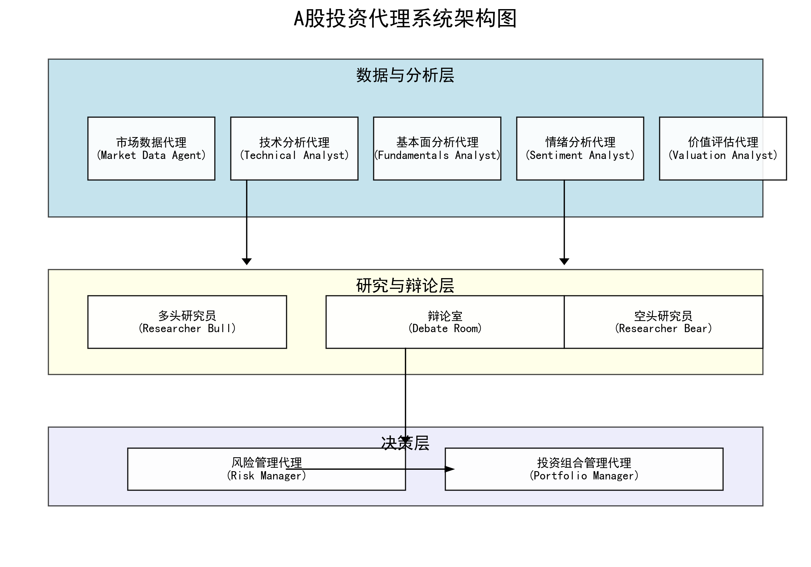

<h1 align="center">
	🦉A股投资代理系统
</h1>


<div align="center">
<h4 align="center">
<div align="center">
基于OWL/camel框架的多代理A股投资分析系统，使用Camel框架实现。
</div>

[English](README_EN.md) |
[中文](README.md) |
[致谢](#-致谢) |
[示例运行结果](#-示例运行结果)

</h4>
</div>

<div align="center">
  
</div>

## 📋 项目简介

本项目是一个基于OWL框架和Camel框架(v0.2.36)的多代理A股投资分析系统，通过多个专业角色代理协作完成投资分析，为用户提供投资决策建议。系统采用多模型支持，可灵活使用不同的大语言模型（如Gemini、OpenAI、Qwen）进行分析。

本项目参与了OWL社区用例挑战赛，是对开源项目[A_Share_investment_Agent](https://github.com/24mlight/A_Share_investment_Agent)的改进版本，使用OWL和Camel框架重构实现。

### 🌟 核心特点

- **多代理协作体系**: 通过10个专业角色代理协作进行分析，实现更全面、专业的投资决策
- **多模型支持**: 支持Gemini、OpenAI、Qwen等多种大语言模型，灵活切换
- **A股市场特化**: 专为A股市场设计，关注中国股市特性和数据
- **辩论与决策机制**: 创新的多空观点辩论机制，平衡分析观点
- **完整的数据处理流水线**: 从数据收集到分析再到决策的全流程支持

## 🏗️ 系统架构

系统架构包含以下几个核心代理：

### 📊 数据与分析层
1. **市场数据代理** (Market Data Agent) - 负责收集和预处理市场数据
2. **技术分析代理** (Technical Analyst) - 分析技术指标并生成交易信号
3. **基本面分析代理** (Fundamentals Analyst) - 分析基本面数据并生成交易信号
4. **情绪分析代理** (Sentiment Analyst) - 分析市场情绪并生成交易信号
5. **价值评估代理** (Valuation Analyst) - 计算股票内在价值并生成交易信号

### 🔍 研究与辩论层
6. **多头研究员** (Researcher Bull) - 提供看多角度分析
7. **空头研究员** (Researcher Bear) - 提供看空角度分析
8. **辩论室** (Debate Room) - 整合多空观点形成最终观点

### 🧮 决策层
9. **风险管理代理** (Risk Manager) - 计算风险指标并设置仓位限制
10. **投资组合管理代理** (Portfolio Manager) - 制定最终交易决策并生成订单

## 💻 安装指南

### 前提条件

- Python 3.9+
- 相关API密钥（Gemini/OpenAI/Qwen）

### 安装步骤

1. 克隆OWL仓库并进入项目目录
```bash
git clone https://github.com/camel-ai/owl.git
cd owl/community_usecase/a_share_investment_agent_camel
```

2. 安装依赖
```bash
pip install -r requirements.txt
```

3. 配置环境变量（创建.env文件）
```
# Gemini配置
GEMINI_API_KEY=your_gemini_api_key
GEMINI_MODEL=gemini-1.5-flash

# OpenAI配置
OPENAI_API_KEY=your_openai_api_key
OPENAI_MODEL=gpt-4o

# Qwen配置
QWEN_API_KEY=your_qwen_api_key
QWEN_MODEL=qwen-max
QWEN_API_URL=https://your-qwen-api-endpoint
```

### Docker 使用方法

为了简化安装流程，我们提供了Docker支持。

1. 构建Docker镜像
```bash
docker build -t a-share-investment-agent .
```

2. 创建包含API密钥的.env文件
```bash
# 创建与上述相同格式的.env文件
touch .env
# 编辑.env文件添加您的API密钥
```

## 🚀 使用方法

### 基本用法

```bash
python src/main.py --ticker 000001 --model qwen
```

### 测试模式

```bash
# 使用默认参数（Qwen模型和000001股票）进行测试
python src/main.py --test

# 指定股票进行测试
python src/main.py --test --ticker 600036
```

### 参数说明

- `--ticker`: 股票代码
- `--start-date`: 开始日期 (YYYY-MM-DD)
- `--end-date`: 结束日期 (YYYY-MM-DD)
- `--show-reasoning`: 显示分析推理过程
- `--num-of-news`: 情绪分析使用的新闻数量
- `--initial-capital`: 初始现金金额
- `--initial-position`: 初始股票持仓
- `--model`: 使用的模型 (gemini, openai, qwen)
- `--test`: 使用预设参数运行测试功能

### 示例运行结果

以下是针对寒武纪-U(688256)股票在2025/01/04-2025/03/24期间的分析结果示例：

```bash
python src/main.py --ticker 688256 --start-date 2025-01-04 --end-date 2025-03-24 --model qwen --show-reasoning
```

#### 各代理分析日志

**市场数据代理**:
```json
{
"trend": "短期趋势向下，但长期趋势仍需观察",
"judgment": "当前价格处于布林带中轨下方，RSI接近中性水平，MACD线在信号线下方，表明短期可能继续调整。但考虑到之前的大幅上涨，长期趋势仍需进一步观察。建议关注支撑位670.66和阻力位747.57。"
}
```

**技术分析代理**:
```json
{
  "signal": "bearish",
  "confidence": 0.8,
  "reasoning": "从技术指标来看，该股票目前处于一个相对弱势的状态。首先，5日均线（718.856）已经下穿10日均线（743.927）和20日均线（747.574），这表明短期趋势正在走弱。MACD指标也显示了类似的趋势，MACD线（8.994）低于信号线（20.004），并且MACD柱状图（-11.009）为负值，表明市场动能正在减弱。RSI指标（48.676）处于中性区域，但接近超卖区域，这可能预示着短期内可能会有反弹，但整体趋势仍然偏弱。布林带方面，当前价格（685.05）接近布林带下轨（670.657），这可能提供一定的支撑，但考虑到其他指标的弱势表现，支撑力度可能有限。综合来看，当前的市场环境和技术指标均指向一个偏空的趋势。"
}
```

**基本面分析代理**:
```json
{
  "signal": "bearish",
  "confidence": 0.8,
  "reasoning": "寒武纪-U的财务状况和业务表现显示出明显的负面趋势。首先，公司的净利润持续为负，且亏损额在最近几个季度有所增加，这表明公司在盈利能力方面存在严重问题。其次，公司的营业收入虽然在2023年第四季度有所增长，但随后几个季度出现了显著下降，这可能意味着市场需求或公司市场份额的减少。此外，公司的市盈率为负，市净率高达52.58，表明市场对其估值过高，存在较大的泡沫风险。从财务健康状况来看，尽管公司的资产负债率较低，但其经营现金流持续为负，表明公司在运营过程中面临较大的资金压力。综合以上因素，我们认为寒武纪-U的股票目前处于看跌状态。"
}
```

**情绪分析代理**:
```json
{
  "signal": "bullish",
  "confidence": 0.8,
  "reasoning": "从新闻数据来看，整体市场情绪偏向积极，积极新闻数量远多于消极新闻。尽管有一条新闻提到芯片ETF和寒武纪-U的下跌，但大多数新闻都强调了寒武纪-U及其所在板块的积极表现，包括股价上涨和技术突破等。此外，寒武纪-U被纳入富时中国A50指数的消息也表明市场对其长期前景持乐观态度。社交媒体讨论也主要集中在公司的积极发展上，进一步支持了看涨的观点。",
  "key_events": [
    "寒武纪-U被纳入富时中国A50指数",
    "寒武纪-U股价多次上涨",
    "人工智能AIETF持仓股寒武纪-U大涨",
    "智元启元大模型发布"
  ]
}
```

**估值分析代理**:
```json
{
  "signal": "bearish",
  "confidence": 0.85,
  "reasoning": "寒武纪-U的财务状况和业务表现显示出明显的负面趋势。首先，公司的净利润持续为负，且亏损额在最近几个季度有所增加，这表明公司在盈利能力方面存在严重问题。其次，公司的营业收入虽然在2023年第四季度有所增长，但随后几个季度出现了显著下降，这可能意味着市场需求或公司市场份额的减少。此外，公司的市盈率为负，市净率高达52.58，表明市场对其估值过高，存在较大的泡沫风险。从财务健康状况来看，尽管公司的资产负债率较低，但其经营现金流持续为负，表明公司在运营过程中面临较大的资金压力。综合以上因素，我们认为寒武纪-U的股票目前处于看跌状态。此外，通过DCF模型和相对估值法计算，公司的内在价值显著低于当前市场价格，进一步支持了看跌的观点。",
  "fair_value": 200.0,
  "key_metrics": [
    "市盈率",
    "市净率",
    "营业收入",
    "净利润",
    "经营现金流"
  ]
}
```

**多头研究员**:
```json
{
  "key_points": [
    "市场情绪积极，新闻和社交媒体讨论偏向乐观",
    "寒武纪-U被纳入富时中国A50指数，表明市场对其长期前景持乐观态度",
    "技术突破和股价上涨的积极新闻",
    "尽管技术面和基本面显示弱势，但市场情绪和潜在催化剂可能推动股价反弹"
  ],
  "confidence": 0.6,
  "reasoning": "尽管技术面和基本面分析显示寒武纪-U目前处于弱势状态，但市场情绪和潜在催化剂可能推动股价反弹。寒武纪-U被纳入富时中国A50指数，表明市场对其长期前景持乐观态度。此外，公司近期的技术突破和股价上涨的积极新闻也支持了看涨的观点。虽然当前的财务状况和估值较高，但市场情绪和潜在的积极因素可能为股价提供支撑。因此，我们建议在短期内保持谨慎，但长期来看，寒武纪-U仍具有投资潜力。"
}
```

**空头研究员**:
```json
{
  "key_points": [
    "技术指标显示短期趋势走弱",
    "净利润持续为负且亏损增加",
    "营业收入下降表明市场需求减少",
    "市净率高达52.58，估值过高",
    "经营现金流持续为负，资金压力大",
    "DCF模型和相对估值法显示内在价值低于市场价格"
  ],
  "confidence": 0.8,
  "reasoning": "综合技术分析、基本面分析、市场情绪分析和估值分析，寒武纪-U的股票目前处于看跌状态。技术指标显示短期趋势走弱，基本面分析显示公司盈利能力差、市场需求减少、估值过高且资金压力大。尽管市场情绪偏向积极，但这些积极情绪主要集中在短期事件上，无法掩盖长期基本面问题。估值分析进一步支持了看跌的观点，内在价值显著低于当前市场价格。因此，建议卖出寒武纪-U的股票。"
}
```

**辩论室**:
```json
{
  "signal": "neutral",
  "confidence": 0.7,
  "reasoning": "多头和空头研究员的观点都有其合理性和依据。多头研究员强调市场情绪积极、寒武纪-U被纳入富时中国A50指数以及技术突破和股价上涨的积极新闻，这些因素可能在短期内为股价提供支撑。然而，空头研究员指出技术指标显示短期趋势走弱，基本面分析显示公司盈利能力差、市场需求减少、估值过高且资金压力大。尽管市场情绪偏向积极，但这些积极情绪主要集中在短期事件上，无法掩盖长期基本面问题。综合来看，短期内市场情绪和技术突破可能推动股价反弹，但长期基本面问题仍然存在，因此建议保持中立态度，等待更多明确信号。",
  "final_verdict": "建议投资者在短期内保持谨慎，关注市场情绪和技术突破的持续性。长期来看，需要密切关注公司的基本面改善情况，特别是盈利能力、市场需求和资金压力等方面。在没有更多明确信号之前，建议保持中立态度，避免过度乐观或悲观。"
}
```

**风险管理代理**:
```json
{
  "max_position_size": 0.2,
  "volatility": 0.15,
  "risk_score": 0.7,
  "max_drawdown": 0.25,
  "suggested_position_size": 0.15,
  "reasoning": "鉴于股票688256较高的波动性和基本面风险，建议采取谨慎态度。虽然短期内存在技术突破的可能性，但长期来看公司面临盈利能力差等问题。因此，建议控制持仓比例不超过20%，并设置适当的止损点以保护资本。同时，通过多样化投资来分散风险。"
}
```

**投资组合管理代理（最终决策）**:
```json
{
  "action": "hold",
  "quantity": 0,
  "confidence": 0.8,
  "reasoning": "综合考虑各类分析师的交易信号、辩论结果、风险分析、当前投资组合状况以及最新市场价格，我们决定对股票688256采取持有策略。技术分析和基本面分析均显示该股票处于弱势状态，技术指标显示短期趋势走弱，基本面显示公司盈利能力差、市场需求减少、估值过高且资金压力大。尽管情绪分析显示市场情绪偏向积极，但这些积极情绪主要集中在短期事件上，无法掩盖长期基本面问题。辩论结果也建议在短期内保持谨慎，关注市场情绪和技术突破的持续性。长期来看，需要密切关注公司的基本面改善情况。风险分析建议控制持仓比例不超过20%，并设置适当的止损点以保护资本。因此，我们决定暂时持有该股票，等待更多明确信号。"
}
```

#### 综合结论

**最终投资决策**: 持有 (置信度: 0.8)

多个专业代理的分析结果表明，寒武纪-U(688256)股票目前处于技术和基本面的弱势状态，但市场情绪和短期事件可能为股价提供支撑。综合考虑各方面因素，系统建议对该股票采取持有策略，密切关注后续基本面变化和市场情绪变化。同时，风险管理建议将该股票的最大持仓比例控制在投资组合的20%以内，并设置适当的止损点以控制风险。

## 🔄 数据流程说明

系统的数据流程遵循以下步骤：

1. **数据采集**: 市场数据代理通过akshare API收集A股市场数据和新闻
2. **多维分析**: 由4个专业分析代理（技术、基本面、情绪、估值）独立进行分析
3. **正反研究**: 多头和空头研究员分别从看多和看空角度提供分析报告
4. **辩论整合**: 辩论室整合多空观点形成最终分析意见
5. **风险评估**: 风险管理代理评估投资风险并设置交易限制
6. **最终决策**: 投资组合管理代理制定最终交易决策并生成订单


## 📋 项目结构

```
community_usecase/a_share_investment_agent_camel/
├── src/                       # 源代码目录
│   ├── agents/                # 代理实现
│   │   ├── base_agent.py      # 代理基类
│   │   ├── market_data_agent.py  # 市场数据代理
│   │   ├── technical_analyst.py  # 技术分析代理
│   │   └── ...
│   ├── tools/                 # 工具模块
│   │   └── data_helper.py     # 数据辅助工具
│   ├── utils/                 # 实用工具
│   │   └── logging_utils.py   # 日志工具
│   ├── models.py              # 数据模型定义
│   ├── roles.py               # 角色定义
│   └── main.py                # 主程序
├── tests/                     # 测试目录
├── logs/                      # 日志文件
├── .env                       # 环境变量
├── pyproject.toml             # Poetry配置
├── requirements.txt           # 依赖项
└── README.md                  # 说明文档
```

## 🔍 代码实现亮点

### 1. 多代理协作架构

本项目实现了10个专业角色的代理，每个代理负责投资分析流程中的特定任务。代理之间通过消息传递进行协作，形成完整的分析决策链条。

```python
# 创建代理
market_data_agent = MarketDataAgent(show_reasoning=show_reasoning, model_name=model_name)
technical_analyst = TechnicalAnalystAgent(show_reasoning=show_reasoning, model_name=model_name)
fundamentals_analyst = FundamentalsAnalystAgent(show_reasoning=show_reasoning, model_name=model_name)
sentiment_analyst = SentimentAnalystAgent(show_reasoning=show_reasoning, model_name=model_name)
valuation_analyst = ValuationAnalystAgent(show_reasoning=show_reasoning, model_name=model_name)
researcher_bull = ResearcherBullAgent(show_reasoning=show_reasoning, model_name=model_name)
researcher_bear = ResearcherBearAgent(show_reasoning=show_reasoning, model_name=model_name)
debate_room = DebateRoomAgent(show_reasoning=show_reasoning, model_name=model_name)
risk_manager = RiskManagerAgent(show_reasoning=show_reasoning, model_name=model_name)
portfolio_manager = PortfolioManagerAgent(show_reasoning=show_reasoning, model_name=model_name)
```

### 2. 灵活的多模型支持

系统支持包括Gemini、OpenAI和Qwen在内的多种大语言模型，通过统一的接口实现灵活切换。

```python
def get_llm_client(model_name: str):
    """获取指定的LLM客户端"""
    if model_name.lower() == 'gemini':
        return GeminiClient()
    elif model_name.lower() == 'openai':
        return OpenAIClient()
    elif model_name.lower() == 'qwen':
        return QwenClient()
    else:
        raise ValueError(f"不支持的模型: {model_name}")
```


## 📝 改进与创新

相较于原始版本，基于Camel框架重构的系统具有以下创新和改进：

1. **模块化设计**: 更清晰的代理定义和系统结构，便于扩展和维护
2. **多模型支持**: 灵活支持多种LLM模型，提高系统适应性
3. **完善的日志系统**: 详细记录各代理的工作过程，便于调试和分析


## ⚠️ 免责声明

本项目仅用于**教育和研究目的**。

- 不适用于实际交易或投资
- 不提供任何保证
- 过往业绩不代表未来表现
- 创建者不承担任何财务损失责任
- 投资决策请咨询专业理财顾问

使用本软件即表示您同意仅将其用于学习目的。

## 📚 相关资源

- [OWL框架官方文档](https://github.com/camel-ai/owl)
- [Camel框架官方文档](https://github.com/camel-ai/camel)
- [A_Share_investment_Agent](https://github.com/24mlight/A_Share_investment_Agent)

## 🙏 致谢

本项目基于以下开源项目进行改进：

1. [A_Share_investment_Agent](https://github.com/24mlight/A_Share_investment_Agent) - 原始A股投资代理项目，为本项目提供了基础架构和投资分析思路，特别感谢其在A股数据处理和分析策略方面的创新设计。
2. [ai-hedge-fund](https://github.com/virattt/ai-hedge-fund.git) - 原始美股投资代理项目
3. [Camel框架](https://github.com/camel-ai/camel) - 多代理对话框架
4. [OWL框架](https://github.com/camel-ai/owl) - 开源多智能体协作框架

感谢所有原作者的贡献和启发，为本项目提供了坚实的基础。 