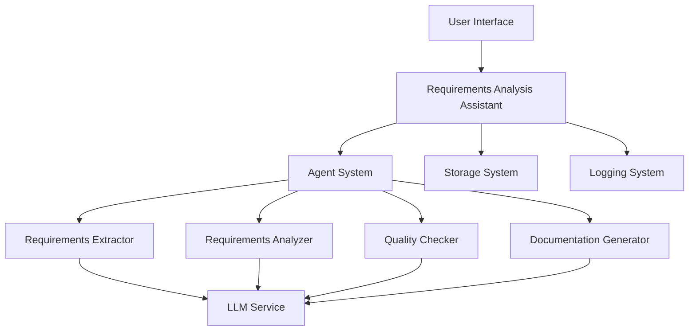
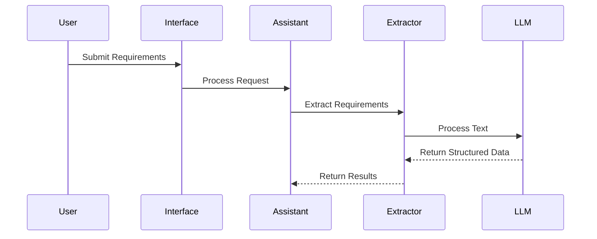
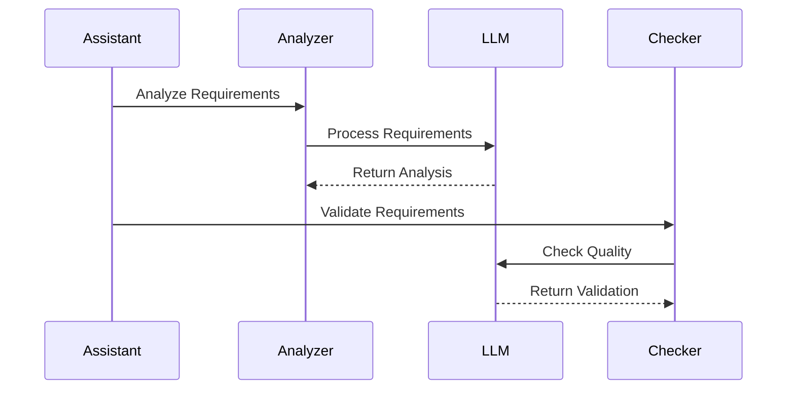
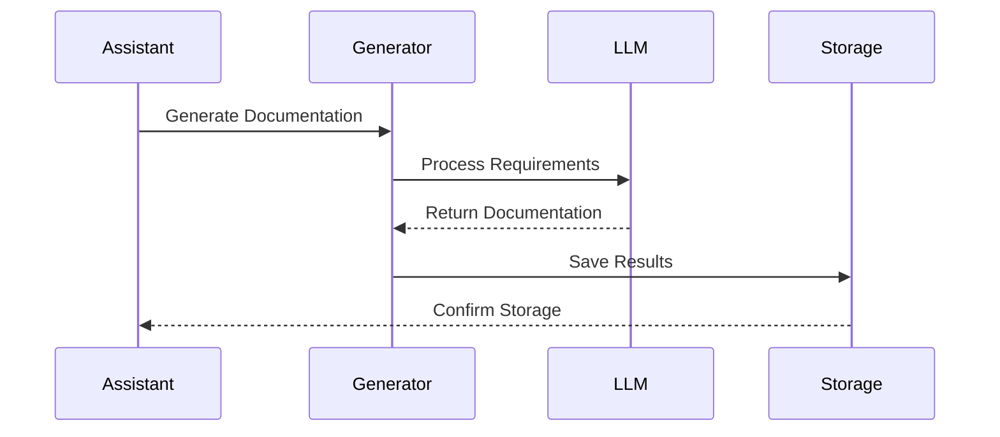
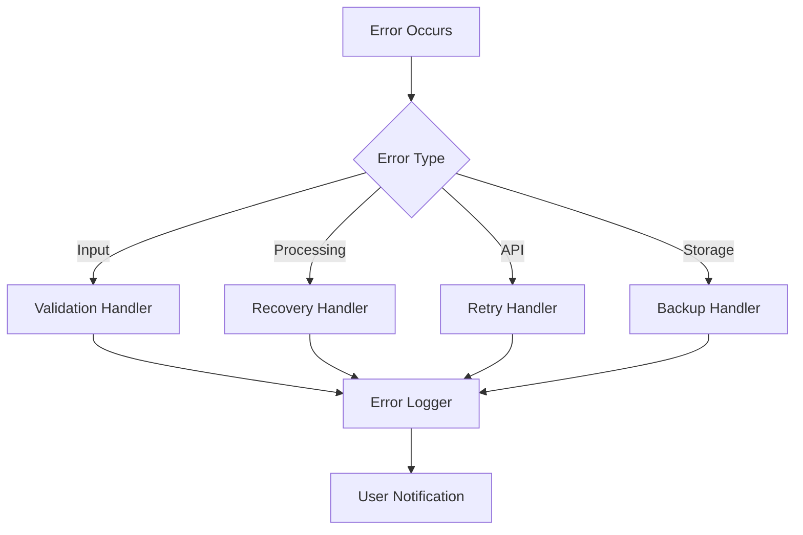
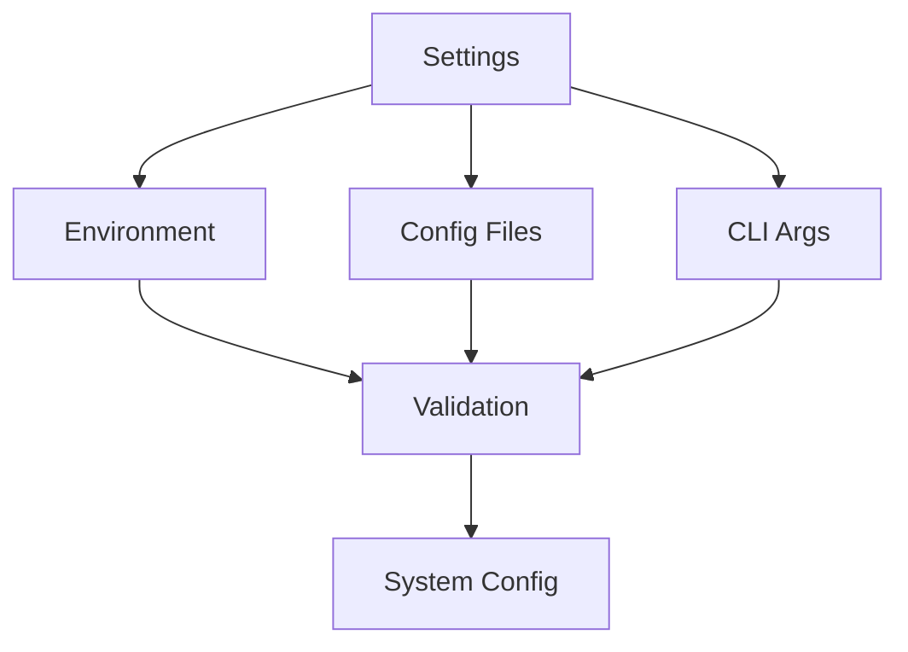
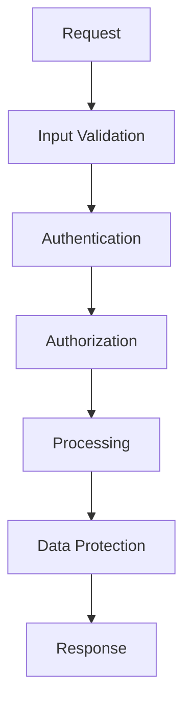
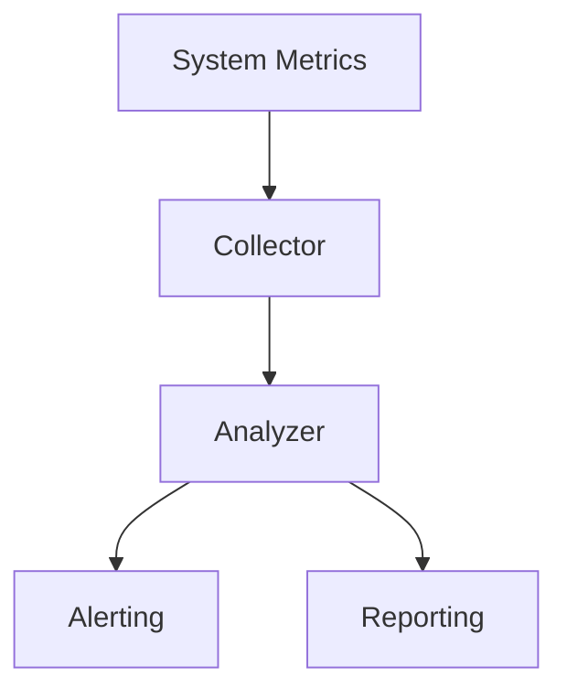

# Architecture Guide

## Overview

The OWL Requirements Analysis Assistant follows a multi-agent architecture based on the OWL Framework. This guide explains the system's architecture, components, and their interactions.

## System Architecture

## Components

### 1. User Interface Layer

#### CLI Interface
- Interactive command-line interface
- Command history and completion
- Progress feedback
- Error handling

#### Web Interface
- RESTful API endpoints
- WebSocket support for real-time updates
- Swagger documentation
- CORS support

### 2. Core System

#### Requirements Analysis Assistant
- Main orchestrator
- Manages agent lifecycle
- Handles request processing
- Coordinates responses

#### Agent System
- Agent initialization and configuration
- Inter-agent communication
- Resource management
- Error handling

### 3. Intelligent Agents

#### Requirements Extractor
- Extracts requirements from text
- Classifies requirement types
- Identifies dependencies
- Assigns unique identifiers

#### Requirements Analyzer
- Analyzes requirement quality
- Checks consistency
- Evaluates feasibility
- Identifies risks

#### Quality Checker
- Validates against standards
- Checks completeness
- Suggests improvements
- Generates quality metrics

#### Documentation Generator
- Creates structured documentation
- Generates summaries
- Produces reports
- Maintains traceability

### 4. Services

#### LLM Service
- Manages LLM interactions
- Handles API communication
- Implements retry logic
- Manages rate limiting

#### Storage System
- Persists analysis results
- Manages file operations
- Handles versioning
- Implements backup

#### Logging System
- Records system events
- Manages log rotation
- Supports different levels
- Enables debugging

## Data Flow

1. **Input Processing**

2. **Analysis Flow**

3. **Documentation Flow**

## Error Handling

### Error Types
1. Input Validation Errors
2. Processing Errors
3. API Errors
4. Storage Errors

### Error Flow

## Configuration

### Component Configuration

## Security

### Security Layers
1. Input Validation
2. Authentication
3. Authorization
4. Data Protection

### Security Flow

## Performance

### Optimization Areas
1. LLM Request Batching
2. Response Caching
3. Parallel Processing
4. Resource Management

### Performance Monitoring

## Extension Points

### Plugin System
1. Custom Agents
2. Custom Validators
3. Custom Generators
4. Custom Storage

### Integration Points
1. External APIs
2. Custom LLMs
3. Storage Systems
4. Monitoring Tools 